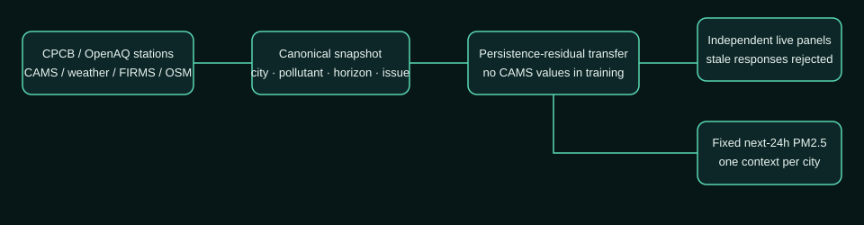

# AirView AI final system architecture

AirView AI is built as a source-honest operational decision-support system. Current provider data and validated historical artifacts share a common dashboard contract, so provider failure changes the mode and provenance rather than breaking the product or substituting invented values.

## 1. Evidence layer

### Current providers

- **OpenAQ v3**: recent CAAQMS-style station observations and hourly history when available.
- **Open-Meteo Air Quality**: CAMS PM2.5/PM10 current and 24-72 hour numerical outlook.
- **Open-Meteo Weather**: wind, precipitation, pressure, humidity, visibility, and boundary-layer height.
- **NASA FIRMS**: near-real-time VIIRS thermal anomalies within a bounded city-region query.
- **OpenStreetMap**: cached road, industrial, construction, waste, railway, and vulnerable-location proxy evidence where available.

### Validated historical layer

- OpenAQ public archive measurements
- station-aligned weather features
- chronological train/validation/test splits
- persistence and seasonal baselines
- Ridge forecast model artifacts
- source-influence and intervention reports
- canonical historical FIRMS events
- curated historical replay files

## 2. Operational fusion

The backend fetches live evidence concurrently. Calls have bounded connection/read timeouts, retry policies, and TTL caches. It then chooses the current concentration in this order:

1. recent OpenAQ station observation;
2. labelled CAMS modelled current value;
3. validated historical replay when the operational providers cannot support the request.

A replay response has `mode=historical_replay`, `live=false`, historical freshness, and a prominent disclaimer. A current response has `mode=operational_forecast` and includes provider-specific provenance.

## 3. Forecast engine

For each selected city, pollutant, and horizon:

1. construct up to seven days of causal station/CAMS history;
2. obtain the future CAMS concentration trajectory;
3. calculate the difference between the freshest current value and the CAMS current field;
4. decay that bias through the future horizon;
5. construct the validated feature schema for 24, 48, and 72-hour Ridge endpoint models;
6. apply endpoint corrections only when the matching model exists and feature completeness is adequate;
7. interpolate corrections across the hourly trajectory;
8. attach historically calibrated 90% intervals;
9. compute exploratory CPCB-style PM sub-index categories from the rolling 24-hour sequence where available.

Persistence remains a legitimate champion/fallback wherever ML did not outperform it during validation.

## 4. Geospatial intervention layer

The product map includes only bounded evidence:

- monitoring station location;
- 25 one-kilometre planning cells around the station;
- current or replay-aligned FIRMS markers;
- station-centred hotspot marker;
- wind context;
- OpenStreetMap attribution and availability status.

The grid modifies the city-scale forecast using transparent distance, wind-direction, and stagnation factors. It is an intervention-planning downscaling, not a claim that a sparse station network resolves an independent atmospheric model at 1 km.

## 5. Source screening and action engine

Evidence categories include:

- traffic and transport;
- industrial activity;
- construction and resuspended road dust;
- waste or biomass-burning activity;
- regional thermal-anomaly influence;
- secondary formation / meteorological accumulation;
- unresolved background.

OSM categories are unavailable when local spatial evidence is missing. FIRMS markers are called "satellite-detected thermal anomalies" and are not automatically labelled as crop, waste, or industrial burning. Scores are normalised influence indicators, not emission shares.

The action engine maps leading evidence categories to a structured intervention catalogue. Each recommendation carries agency, response time, cost tier, sensitivity range, and caveat. Field verification remains mandatory.

## 6. Citizen communication

The advisory engine renders deterministic, versionable public-information messages in:

- English;
- Hindi (Devanagari);
- Punjabi (Gurmukhi).

Messages include severity, timing, protective actions, and a public-information disclaimer. They do not diagnose conditions or recommend medication changes.

## 7. Product boundary

The frontend is a single demo-facing command dashboard. It does not expose development logs, raw exceptions, test reports, or internal validation pages. The main API surface is `/api/operations/*`; the older research endpoints remain in the backend for reproducibility but are not linked from the production UI.

## 8. Deployment

`scripts/run_demo.ps1` builds the frontend, validates critical artifacts, starts the current FastAPI and Vite source, waits for readiness, and records only demo-owned processes. `scripts/verify_demo.ps1` verifies the five replay city workflows and frontend routes. `scripts/stop_demo.ps1` stops only recorded demo processes.
